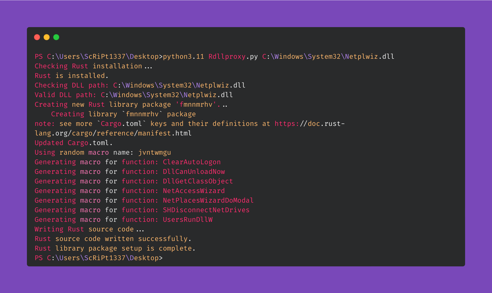

# RustDllProxy
Retrieves exported functions from a legitimate DLL and generates a proxy DLL source code/template in rust for DLL proxy loading or sideloading

## Prerequisites

- **Python 3.11**: Ensure Python 3 is installed on your system.
- **Rust**: Ensure Rust is installed. You can download it from [Rust's official site](https://www.rust-lang.org/tools/install).

## Installation

1. **Setup everything:**

   ```sh
   git clone https://github.com/ScRiPt1337/RustDllProxy
   cd RustDllProxy
   pip install -r requirements.txt
   ```

## Usage

- **To use the script, provide the path to the DLL file you want to work with:**

    ```sh
    python Rdllproxy.py <path_to_dll>
    ```

- **Replace <path_to_dll> with the path to the DLL file from which you want to extract functions.**

- **Example**

    ```sh
    python3 Rdllproxy.py C:\Windows\System32\Netplwiz.dll
    ```




## Credits

    [SharpDllProxy](https://github.com/Flangvik/SharpDllProxy)
